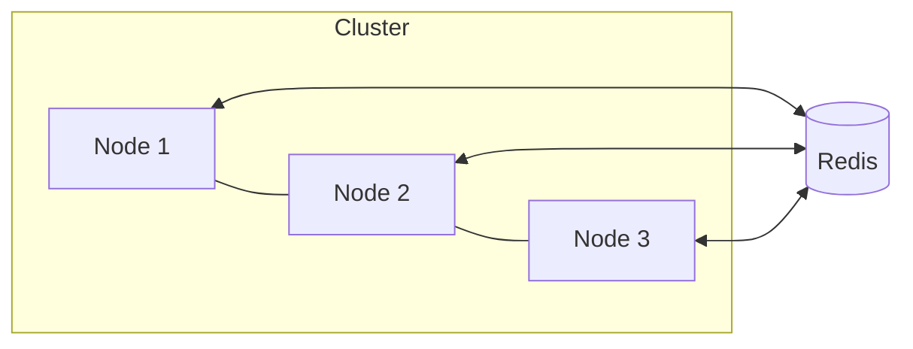

# Arsitektur Sistem (High-Level)

- **Consensus (Raft)** untuk replikasi perintah Lock (state machine).
- **Queue**: consistent hashing partisi -> penyimpanan di Redis (ready / processing) + at-least-once via visibility timeout dan ack.
- **Cache**: MESI sederhana dengan invalidasi melalui Redis Pub/Sub + LRU.

Kegagalan node ditangani dengan (a) pemilihan ulang leader (Raft), (b) rebalancing ring (dengan menambah/menghapus node pada konfigurasi), (c) recovery pesan kadaluarsa.
